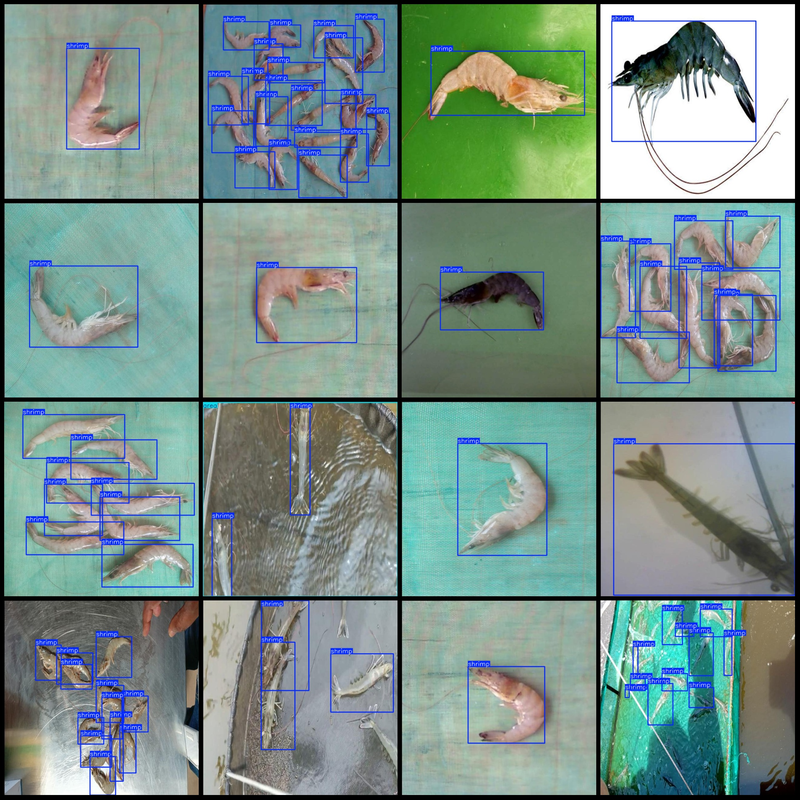
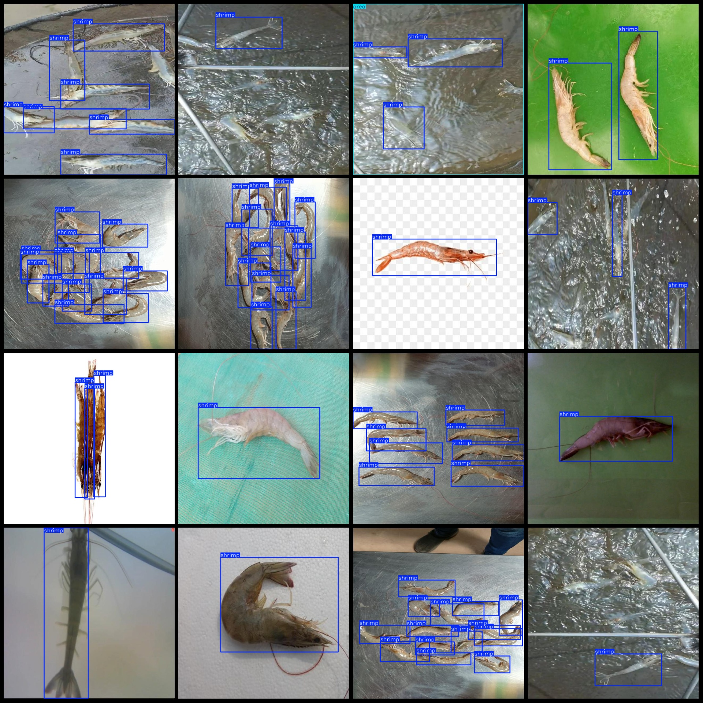

# Detecting and Counting Shrimp Clusters in the VOC+YOLO Format with 3360 Images in Two Categories

Dataset format: Pascal VOC format + YOLO format (without split path in txt file, only contain jpg images and corresponding VOC format xml files and yolo format txt files)

Number of images (jpg file count): 3360
Number of labels (xml file count): 3360
Number of labels (txt file count): 3360
Number of label categories: 2
Label category names (note that the order of labels in yolo format does not correspond to this, but refer to the classes.txt in the labels folder): ["area", "shrimp"]
Each category labeled boxes:
- Area box count = 61
- Shrimp box count = 18712
Total boxes: 18773
Each category occupied images:
- Area occupied images = 29
- Shrimp occupied images = 3360
Image resolution: 640x640
Annotation tool used: labelImg
Annotation rules: draw rectangle boxes for each category
Important note: The dataset does not have been divided into training, validation, and test sets, and you need to divide them yourself.
Special declaration: This dataset does not guarantee the accuracy of the trained models or weight files.
Image preview:
Annotation example:
The given text does not contain any markdown formatting.

Here is a pay link on Stripe ( https://buy.stripe.com/3cs8yP7sY87d0vu9AB ). Please contact me lonlonago@foxmail.com after funding $89, and I will send you a complete data files , thank you!

